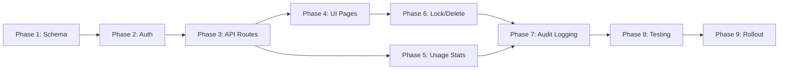

# Customer Portal Admin Dashboard — Implementation Plan

## Context

The customer-portal app is a Next.js (App Router) application backed by PostgreSQL via Prisma. It already has:
- A minimal admin surface at `/admin/` with Analytics and Forecast pages
- Bearer-token auth on admin API routes (`ADMIN_API_SECRET`)
- User, Plan, UserApiKey, and Payment Prisma models
- OmniRoute integration for API key management and usage analytics
- Stripe integration for billing/checkout

This plan adds a full-featured admin dashboard covering user management, plan assignment, locking/deleting, audit logging, and a staged rollout.

---

## Architecture Overview

```mermaid
flowchart TD
    subgraph "Admin UI Layer"
        A[Admin Layout] --> B[Users Page]
        A --> C[Plans Page]
        A --> D[Analytics Page]
        A --> E[Audit Log Page]
    end
    
    subgraph "API Routes"
        F[GET /api/admin/users] --> G[(PostgreSQL)]
        G --> H[AuditLog Table]
        F --> I[OmniRoute API]
        J[PATCH /api/admin/users/:id] --> G
        K[DELETE /api/admin/users/:id] --> G
        L[POST /api/admin/users/:id/lock] --> G
        M[POST /api/admin/users/:id/plan] --> G
    end
    
    subgraph "Auth / Permissions"
        N[Admin Role Field on User] --> O[requireAdmin middleware]
        O --> P[Role: admin | superadmin]
    end
```

---

## Step-by-Step Implementation

### Phase 1: Prisma Schema Changes

**Step 1.1** — Add `isAdmin` boolean flag to the `User` model.

- File: `customer-portal/prisma/schema.prisma`
- Add `isAdmin Boolean @default(false) @map("is_admin")` to the `User` model
- Add `isLocked Boolean @default(false) @map("is_locked")` to the `User` model
- Add `lockedAt DateTime? @map("locked_at")` to the `User` model

**Step 1.2** — Add `AuditLog` model for admin actions.

```prisma
model AuditLog {
  id          String   @id @default(uuid())
  adminId     String   @map("admin_id")
  action      String   // e.g. "user.lock", "user.plan_change", "user.delete"
  targetId    String?  @map("target_id")
  targetType  String?  @map("target_type")
  metadata    Json?
  createdAt   DateTime @default(now()) @map("created_at")

  @@map("audit_logs")
}
```

**Step 1.3** — Add `PlanAssignment` model for plan change history.

```prisma
model PlanAssignment {
  id        String   @id @default(uuid())
  userId    String   @map("user_id")
  planId    String   @map("plan_id")
  assignedBy String  @map("assigned_by")
  createdAt DateTime @default(now()) @map("created_at")

  @@map("plan_assignments")
}
```

**Step 1.4** — Run Prisma migration.

```bash
cd customer-portal
npx prisma migrate dev --name add_admin_audit_plan_assignment
```

**Verification:**
- [ ] `npx prisma migrate status` shows applied migration
- [ ] `npx prisma studio` shows all new fields and tables

---

### Phase 2: Auth & Permission Model

**Step 2.1** — Update `requireAuth` to support admin roles.

- File: `customer-portal/src/lib/auth.ts`
- Create `requireAdmin()` function that calls `requireAuth()` then checks `user.isAdmin === true`
- Throw `Error('FORBIDDEN')` if not admin

**Step 2.2** — Create admin middleware helper.

```typescript
// customer-portal/src/lib/admin.ts
export async function requireAdmin() {
  const user = await requireAuth();
  if (!user.isAdmin) throw new Error('FORBIDDEN');
  return user;
}
```

**Step 2.3** — Update all existing admin API routes to use `requireAdmin()` instead of Bearer token.

- `customer-portal/src/app/api/admin/analytics/route.ts` — replace `verifyAdminAccess` with `requireAdmin()`
- `customer-portal/src/app/api/admin/forecast/route.ts` — same

**Step 2.4** — Add admin-only route protection on the UI side.

- File: `customer-portal/src/app/admin/layout.tsx`
- On mount, call `GET /api/auth/me` and verify `isAdmin` before rendering children
- Redirect to `/` if not admin

**Verification:**
- [ ] Non-admin users cannot access `/admin/*` pages or API routes
- [ ] Admin users can access all admin routes
- [ ] `requireAdmin()` throws `FORBIDDEN` for non-admins

---

### Phase 3: API Routes

#### 3.1 Users Management API

**Step 3.1.1** — Create `GET /api/admin/users` — list all users with pagination, search, filter.

- Query params: `page`, `limit`, `search`, `planId`, `sortBy`, `sortOrder`
- Response: `{ users: User[], total: number, page: number, totalPages: number }`
- Include: plan, apiKeys, payments, usage summary from OmniRoute
- Use `requireAdmin()`

**Step 3.1.2** — Create `GET /api/admin/users/[id]` — single user detail.

- Include full plan history from `PlanAssignment`
- Include audit logs for this user
- Include all OmniRoute usage for user's keys

**Step 3.1.3** — Create `PATCH /api/admin/users/[id]` — update user fields.

- Updatable: `name`, `email` (with re-verification), `planId`
- Log to `AuditLog` with action `user.update`
- Use `requireAdmin()`

**Step 3.1.4** — Create `POST /api/admin/users/[id]/lock` — lock/unlock user.

- Toggle `isLocked` flag
- If locking: set `lockedAt = now()`
- Log to `AuditLog` with action `user.lock` or `user.unlock`
- Use `requireAdmin()`

**Step 3.1.5** — Create `DELETE /api/admin/users/[id]` — soft-delete or hard-delete user.

- Option via query param `?hard=true`
- Soft-delete: set `email = "deleted_${id}@deleted"`, clear `passwordHash`, set `isLocked = true`
- Hard-delete: cascade delete via Prisma (apiKeys, payments, planAssignments)
- Log to `AuditLog` with action `user.delete`
- Use `requireAdmin()`

#### 3.2 Plan Assignment API

**Step 3.2.1** — Create `POST /api/admin/users/[id]/plan` — assign plan to user.

- Update `user.planId`
- Create `PlanAssignment` record with `assignedBy = adminId`
- If upgrading: no Stripe action needed (admin override)
- If downgrading: optionally cancel Stripe subscription via Stripe API
- Log to `AuditLog` with action `user.plan_change`
- Use `requireAdmin()`

**Step 3.2.2** — Create `GET /api/admin/users/[id]/plan-history` — get plan assignment history.

- Return all `PlanAssignment` records for the user, ordered by `createdAt desc`
- Include plan details for each assignment

#### 3.3 Audit Log API

**Step 3.3.1** — Create `GET /api/admin/audit-logs` — list audit logs.

- Query params: `page`, `limit`, `adminId`, `action`, `targetId`, `dateFrom`, `dateTo`
- Response: `{ logs: AuditLog[], total: number }`
- Use `requireAdmin()`

**Step 3.3.2** — Create `POST /api/admin/audit-logs` (internal) — write audit log entry.

- Not exposed to the UI directly

#### 3.4 Usage Statistics API

**Step 3.4.1** — Enhance existing `GET /api/admin/analytics` to support per-user usage breakdown.

- Already exists at `customer-portal/src/app/api/admin/analytics/route.ts`
- Add query param `?userId=` to get single user's usage
- Add `?range=7d|30d|90d` support (already exists)

**Step 3.4.2** — Create `GET /api/admin/usage/global` — global platform usage stats.

- Total requests, tokens, cost across all users
- Breakdown by plan tier
- Top 10 most active users
- Daily/weekly trend

**Verification:**
- [ ] All new API routes return 401 for unauthenticated requests
- [ ] All new API routes return 403 for non-admin users
- [ ] All mutations write to `AuditLog` table
- [ ] Plan assignment creates `PlanAssignment` record

---

### Phase 4: UI Pages & Components

#### 4.1 Admin Layout Enhancement

**Step 4.1.1** — Update `customer-portal/src/app/admin/layout.tsx`.

- Add navigation items: Users, Plans, Audit Log
- Add admin role check on mount (redirect if not admin)
- Preserve existing Analytics and Forecast nav items

```typescript
const adminNav = [
  { href: '/admin/analytics', label: 'Analytics', icon: '📊' },
  { href: '/admin/forecast', label: 'Forecast Engine', icon: '🔮' },
  { href: '/admin/users', label: 'Users', icon: '👥' },
  { href: '/admin/plans', label: 'Plans', icon: '📦' },
  { href: '/admin/audit-log', label: 'Audit Log', icon: '📋' },
];
```

#### 4.2 Users Management Page

**Step 4.2.1** — Create `customer-portal/src/app/admin/users/page.tsx`.

- Data table with columns: Email, Name, Plan, Status, API Keys, Total Paid, Created, Actions
- Search bar (email/name)
- Filter dropdown: by plan, by status (active/locked/verified)
- Sort by: date, total requests, total paid
- Pagination (20 per page)
- Row actions: View, Lock/Unlock, Change Plan, Delete

**Step 4.2.2** — Create user detail modal or slide-over panel.

- Shows: profile info, plan, API keys, usage summary, plan history, audit logs
- Actions: Change Plan, Lock/Unlock, Delete

**Step 4.2.3** — Create plan change dialog.

- Dropdown to select new plan
- Confirmation with summary of changes
- Shows prorated info if applicable

#### 4.3 Plans Management Page

**Step 4.3.1** — Create `customer-portal/src/app/admin/plans/page.tsx`.

- List all plans with user counts
- Show: name, price, requestsPerDay, requestsPerMonth, allowedModels, userCount
- Actions: View users on plan, Edit plan limits (no Stripe changes here)

#### 4.4 Audit Log Page

**Step 4.4.1** — Create `customer-portal/src/app/admin/audit-log/page.tsx`.

- Table: Timestamp, Admin, Action, Target, Metadata
- Filter by: action type, admin, date range
- Pagination
- Expandable rows to show full metadata JSON

#### 4.5 Shared Components

**Step 4.5.1** — Create `customer-portal/src/components/admin/` directory.

- `DataTable.tsx` — reusable sortable, filterable, paginated table
- `ConfirmDialog.tsx` — reusable confirmation modal
- `PlanBadge.tsx` — colored badge for plan names
- `StatusBadge.tsx` — active/locked/pending badges
- `UserAvatar.tsx` — initials-based avatar with plan color

**Verification:**
- [ ] All admin pages render without errors
- [ ] Navigation between pages works
- [ ] Lock/unlock reflects immediately in UI
- [ ] Plan change reflects immediately in UI

---

### Phase 5: Usage Statistics

**Step 5.1** — Enhance the existing Analytics page at `/admin/analytics`.

- Add summary cards: Total Users, Active Today, Total Revenue, Total Requests
- Add plan distribution pie chart
- Add daily trend line chart
- Add top 10 users by usage table

**Step 5.2** — Create global usage API at `GET /api/admin/usage/global`.

- Aggregate all OmniRoute usage data
- Group by plan tier
- Return daily trend for the selected range

**Step 5.3** — Add usage sparklines to the users table.

- Show small inline chart or number for each user's usage in the last 30 days

**Verification:**
- [ ] Analytics page loads within 3 seconds with 1000 users
- [ ] Charts render correctly with real data

---

### Phase 6: User Locking & Deleting

**Step 6.1** — Implement lock endpoint.

- `POST /api/admin/users/[id]/lock` (see Step 3.1.4)
- Locked users cannot log in (check in `getCurrentUser()` or `requireAuth()`)

**Step 6.2** — Update `requireAuth()` to check `isLocked`.

```typescript
// In auth.ts
if (user.isLocked) {
  throw new Error('ACCOUNT_LOCKED');
}
```

**Step 6.3** — Update login API to handle `ACCOUNT_LOCKED` error.

- File: `customer-portal/src/app/api/auth/login/route.ts`
- Return 423 Locked with message "Account is locked. Contact support."

**Step 6.4** — Implement delete endpoint.

- `DELETE /api/admin/users/[id]` (see Step 3.1.5)
- Soft-delete is the default; hard-delete requires `?hard=true`

**Step 6.5** — Add "Delete User" confirmation dialog.

- Show warning about data loss
- Require typing "DELETE" to confirm
- Option to soft-delete vs hard-delete

**Verification:**
- [ ] Locked user cannot log in
- [ ] Locked user sees "Account is locked" message
- [ ] Deleted user's email is anonymized
- [ ] Hard-deleted user is fully removed from database

---

### Phase 7: Audit Logging

**Step 7.1** — Create audit logging utility.

- File: `customer-portal/src/lib/audit.ts`
- `logAudit(adminId, action, targetId, targetType, metadata)`

**Step 7.2** — Instrument all admin mutations.

- User lock/unlock → `user.lock` / `user.unlock`
- User delete → `user.delete`
- User update → `user.update`
- Plan change → `user.plan_change`
- Plan create/update → `plan.update`

**Step 7.3** — Display audit log in UI.

- `/admin/audit-log` page (see Step 4.4.1)
- Filterable by action, admin, date
- Expandable rows show full metadata

**Verification:**
- [ ] Every admin mutation creates an AuditLog entry
- [ ] Audit log page shows all entries with correct metadata
- [ ] Audit log entries are immutable (no update/delete)

---

### Phase 8: Testing

**Step 8.1** — Unit tests for auth/admin utilities.

- Test `requireAdmin()` throws for non-admin
- Test `requireAdmin()` passes for admin
- Test `logAudit()` creates correct record

**Step 8.2** — API route tests.

- Test each new endpoint returns 401/403 for unauthorized
- Test lock/unlock toggles `isLocked` correctly
- Test plan assignment creates `PlanAssignment` record
- Test delete anonymizes or removes user

**Step 8.3** — UI component tests.

- Test users table renders with mock data
- Test lock/unlock button updates UI optimistically
- Test plan change dialog submits correctly

**Step 8.4** — Integration test.

- Full flow: admin locks user → locked user tries to login → gets 423

**Verification:**
- [ ] All tests pass: `cd customer-portal && npm test`
- [ ] No console errors in browser on admin pages

---

### Phase 9: Rollout

**Step 9.1** — Database migration.

```bash
cd customer-portal
npx prisma migrate deploy
```

**Step 9.2** — Set initial admin user.

- Create a seed script or one-time script to set `isAdmin = true` for the first admin user
- Example: `npx prisma execute "UPDATE users SET is_admin = true WHERE email = 'admin@example.com'"`

**Step 9.3** — Environment variables.

- Ensure `ADMIN_API_SECRET` is set in production (for existing routes)
- New routes use session-based admin auth, so no new env vars needed

**Step 9.4** — Deploy.

```bash
cd customer-portal
npm run build
# Deploy via your existing pipeline (Docker/Vercel/etc.)
```

**Step 9.5** — Smoke test in production.

- [ ] Admin can access `/admin/users`
- [ ] Admin can lock a test user
- [ ] Locked test user cannot log in
- [ ] Admin can unlock test user
- [ ] Admin can change test user's plan
- [ ] Audit log shows all actions

---

## Dependency Graph



**Critical path:** Phase 1 → Phase 2 → Phase 3 → Phase 4 → Phase 9

Phases 5, 6, 7, 8 can run in parallel with Phase 4 after Phase 3 is complete.

---

## File Inventory

| File | Action |
|------|--------|
| `customer-portal/prisma/schema.prisma` | Modify |
| `customer-portal/src/lib/auth.ts` | Modify |
| `customer-portal/src/lib/admin.ts` | Create |
| `customer-portal/src/lib/audit.ts` | Create |
| `customer-portal/src/app/admin/layout.tsx` | Modify |
| `customer-portal/src/app/api/admin/analytics/route.ts` | Modify |
| `customer-portal/src/app/api/admin/users/route.ts` | Create |
| `customer-portal/src/app/api/admin/users/[id]/route.ts` | Create |
| `customer-portal/src/app/api/admin/users/[id]/lock/route.ts` | Create |
| `customer-portal/src/app/api/admin/users/[id]/plan/route.ts` | Create |
| `customer-portal/src/app/api/admin/users/[id]/plan-history/route.ts` | Create |
| `customer-portal/src/app/api/admin/audit-logs/route.ts` | Create |
| `customer-portal/src/app/api/admin/usage/global/route.ts` | Create |
| `customer-portal/src/app/api/auth/login/route.ts` | Modify |
| `customer-portal/src/app/admin/users/page.tsx` | Create |
| `customer-portal/src/app/admin/plans/page.tsx` | Create |
| `customer-portal/src/app/admin/audit-log/page.tsx` | Create |
| `customer-portal/src/components/admin/DataTable.tsx` | Create |
| `customer-portal/src/components/admin/ConfirmDialog.tsx` | Create |
| `customer-portal/src/components/admin/PlanBadge.tsx` | Create |
| `customer-portal/src/components/admin/StatusBadge.tsx` | Create |
| `customer-portal/src/components/admin/UserAvatar.tsx` | Create |

---

## Verification Checklist

### Pre-Rollout
- [ ] Prisma migration applies cleanly
- [ ] All new API routes return correct HTTP status codes for auth failures
- [ ] `isAdmin` check blocks non-admins on all admin routes
- [ ] `isLocked` check blocks locked users from authenticating
- [ ] All admin mutations write to `AuditLog`
- [ ] `PlanAssignment` records are created on plan changes
- [ ] UI pages render without console errors
- [ ] All tests pass

### Post-Rollout
- [ ] Admin can view all users with pagination
- [ ] Admin can search users by email/name
- [ ] Admin can lock a user → user cannot log in
- [ ] Admin can unlock a user → user can log in again
- [ ] Admin can change a user's plan → plan change is reflected immediately
- [ ] Admin can delete a user → user is anonymized or removed
- [ ] Audit log page shows all admin actions
- [ ] Analytics page shows correct global usage data