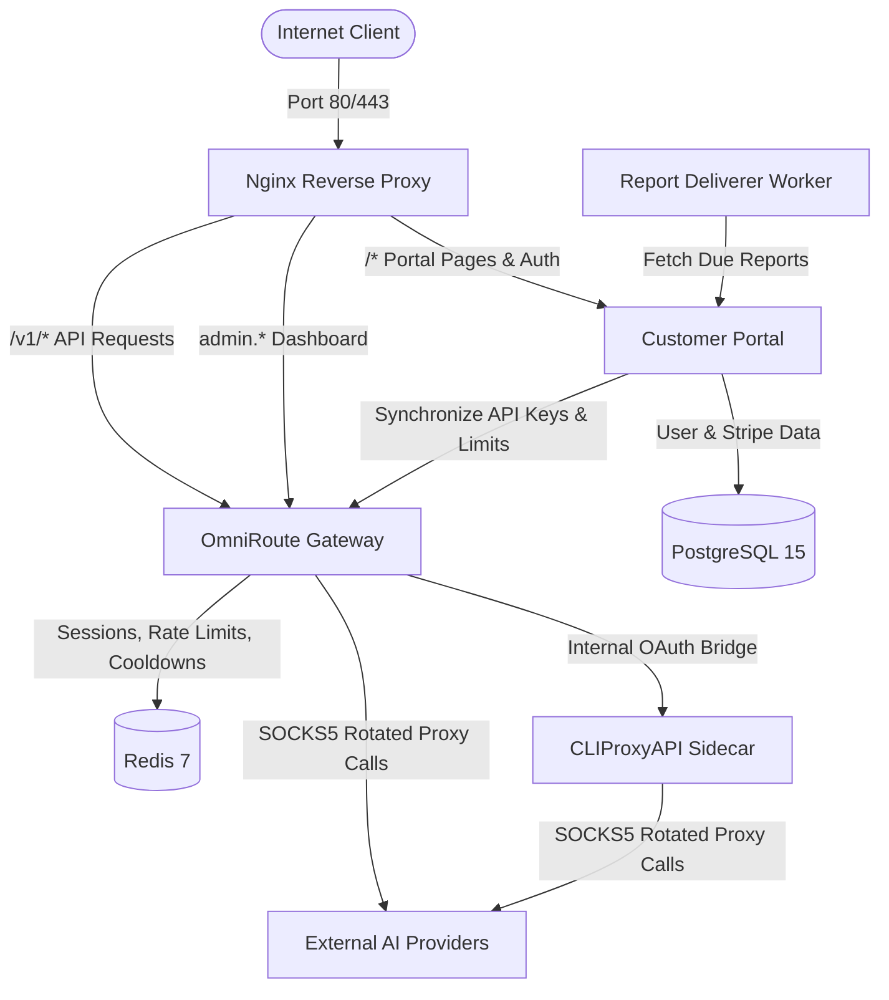
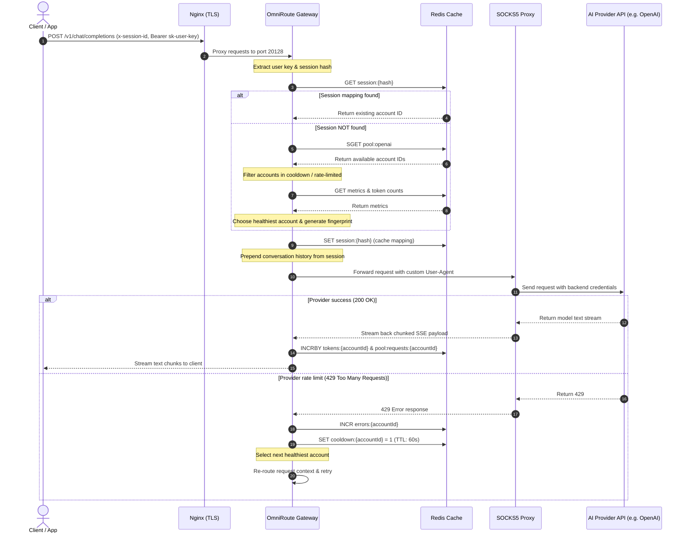

# 🗺️ AI API Platform — Codebase Map & Index

This directory serves as a navigation blueprint for future development, maintenance, and debugging of the AI Platform. It maps out the directories, services, request lifecycles, and database relationships.

---

## 🏛️ System Topology

The system is split into **State** (Postgres, Redis), **Routing & Gateway** (Nginx, OmniRoute, CLIProxyAPI), and the **User Lifecycle Control Plane** (Customer Portal, Report Deliverer).

---

## 📂 Codebase Index & Directory Layout

### 1. Root & Infrastructure Files
- [docker-compose.unified.yml](file:///C:/Users/Administrator/.gemini/antigravity/worktrees/ai-platform/optimize-production-cicd-pipeline/docker-compose.unified.yml) — Unified service stack definition.
- [docker-compose.preview.yml](file:///C:/Users/Administrator/.gemini/antigravity/worktrees/ai-platform/optimize-production-cicd-pipeline/docker-compose.preview.yml) — Preview/staging overrides (ports 22028, 22029, 3301).
- [nginx/nginx.conf](file:///C:/Users/Administrator/.gemini/antigravity/worktrees/ai-platform/optimize-production-cicd-pipeline/nginx/nginx.conf) — Nginx server config (TLS termination, upstreams, proxy buffering off for SSE streaming).
- [setup.sh](file:///C:/Users/Administrator/.gemini/antigravity/worktrees/ai-platform/optimize-production-cicd-pipeline/setup.sh) — Bootstraps environment (TCP tuning, certbot setup, firewall, random secrets generation).
- [deploy.sh](file:///C:/Users/Administrator/.gemini/antigravity/worktrees/ai-platform/optimize-production-cicd-pipeline/deploy.sh) — Rebuilds and deploys only changed Docker services using smart change-detection.
- [deploy-preview.sh](file:///C:/Users/Administrator/.gemini/antigravity/worktrees/ai-platform/optimize-production-cicd-pipeline/deploy-preview.sh) — Staging deploy script.
- [manage.sh](file:///C:/Users/Administrator/.gemini/antigravity/worktrees/ai-platform/optimize-production-cicd-pipeline/manage.sh) — Platform control CLI tool (start, stop, logs, backup, restore, health, shell).

### 2. [customer-portal](file:///C:/Users/Administrator/.gemini/antigravity/worktrees/ai-platform/optimize-production-cicd-pipeline/customer-portal) (Next.js Application)
- [prisma/schema.prisma](file:///C:/Users/Administrator/.gemini/antigravity/worktrees/ai-platform/optimize-production-cicd-pipeline/customer-portal/prisma/schema.prisma) — Database models (`User`, `Plan`, `UserApiKey`, `Payment`, `AuditLog`, `ScheduledReport`).
- [middleware.ts](file:///C:/Users/Administrator/.gemini/antigravity/worktrees/ai-platform/optimize-production-cicd-pipeline/customer-portal/middleware.ts) — Route guards protecting `/admin/*` and `/api/admin/*` endpoints.
- [src/lib/](file:///C:/Users/Administrator/.gemini/antigravity/worktrees/ai-platform/optimize-production-cicd-pipeline/customer-portal/src/lib) — Internal helper modules:
  - [db.ts](file:///C:/Users/Administrator/.gemini/antigravity/worktrees/ai-platform/optimize-production-cicd-pipeline/customer-portal/src/lib/db.ts) — Prisma Client initialization.
  - [auth.ts](file:///C:/Users/Administrator/.gemini/antigravity/worktrees/ai-platform/optimize-production-cicd-pipeline/customer-portal/src/lib/auth.ts) — Customer signup/login verification using JWTs.
  - [admin-session.ts](file:///C:/Users/Administrator/.gemini/antigravity/worktrees/ai-platform/optimize-production-cicd-pipeline/customer-portal/src/lib/admin-session.ts) — Admin session verification (cookie: `admin_session`).
  - [omniroute.ts](file:///C:/Users/Administrator/.gemini/antigravity/worktrees/ai-platform/optimize-production-cicd-pipeline/customer-portal/src/lib/omniroute.ts) — Internal client calling OmniRoute APIs to update keys, limits, and pull usage metrics.
  - [scheduled-reports.ts](file:///C:/Users/Administrator/.gemini/antigravity/worktrees/ai-platform/optimize-production-cicd-pipeline/customer-portal/src/lib/scheduled-reports.ts) — Logic to generate and schedule reports.
  - [stripe.ts](file:///C:/Users/Administrator/.gemini/antigravity/worktrees/ai-platform/optimize-production-cicd-pipeline/customer-portal/src/lib/stripe.ts) — Stripe checkout and customer helper.
  - [email.ts](file:///C:/Users/Administrator/.gemini/antigravity/worktrees/ai-platform/optimize-production-cicd-pipeline/customer-portal/src/lib/email.ts) — Transactional email client (Resend integration).
- [scripts/deliver-scheduled-reports.mjs](file:///C:/Users/Administrator/.gemini/antigravity/worktrees/ai-platform/optimize-production-cicd-pipeline/customer-portal/scripts/deliver-scheduled-reports.mjs) — Background worker running reports.

### 3. [OmniRoute](file:///C:/Users/Administrator/.gemini/antigravity/worktrees/ai-platform/optimize-production-cicd-pipeline/OmniRoute) (Git Submodule)
- Empty in local development workspace until initialized/pulled. Contains:
  - `src/sse/handlers/chat.ts` — API gateway handler for `/v1/chat/completions`.
  - `src/lib/accountPool/` — Account selection, rate limit trackers, error monitors.
  - `src/lib/sessionPersistence/` — Redis session key storage and context caching.
  - `src/lib/antiDetect/` — Request fingerprinting and SOCKS5 proxy routing.

---

## 🛠️ Feature Reference Map

Here is exactly where to locate specific features when troubleshooting or writing new tasks.

### 🔐 Authentication & Session Flow
- **Customer Pages**:
  - Sign Up: [signup/page.tsx](file:///C:/Users/Administrator/.gemini/antigravity/worktrees/ai-platform/optimize-production-cicd-pipeline/customer-portal/src/app/signup)
  - Login: [login/page.tsx](file:///C:/Users/Administrator/.gemini/antigravity/worktrees/ai-platform/optimize-production-cicd-pipeline/customer-portal/src/app/login)
- **Admin Session Guarding**:
  - Cookie token `admin_session` verified by Next.js middleware in [middleware.ts](file:///C:/Users/Administrator/.gemini/antigravity/worktrees/ai-platform/optimize-production-cicd-pipeline/customer-portal/middleware.ts#L8-L40).
  - Helper functions for session generation/verification: [admin-session.ts](file:///C:/Users/Administrator/.gemini/antigravity/worktrees/ai-platform/optimize-production-cicd-pipeline/customer-portal/src/lib/admin-session.ts).
- **Authentication API endpoints**:
  - Portal Authentication API: [customer-portal/src/app/api/auth/](file:///C:/Users/Administrator/.gemini/antigravity/worktrees/ai-platform/optimize-production-cicd-pipeline/customer-portal/src/app/api/auth)
  - Admin Authentication API: [customer-portal/src/app/api/admin/auth/](file:///C:/Users/Administrator/.gemini/antigravity/worktrees/ai-platform/optimize-production-cicd-pipeline/customer-portal/src/app/api/admin/auth)

### 📈 Rate Limits & Pricing Plans
- **Limits Definition**:
  - Plan structure is defined in [schema.prisma lines 37-52](file:///C:/Users/Administrator/.gemini/antigravity/worktrees/ai-platform/optimize-production-cicd-pipeline/customer-portal/prisma/schema.prisma#L37-L52), defining price, `requestsPerDay`, `requestsPerMinute`, `requestsPerMonth`, and `allowedModels`.
- **Syncing Limits to OmniRoute**:
  - When keys are created or upgraded, limits are synced via [omniroute.ts `updateKeyLimits()`](file:///C:/Users/Administrator/.gemini/antigravity/worktrees/ai-platform/optimize-production-cicd-pipeline/customer-portal/src/lib/omniroute.ts#L84-L99).
  - Key management handler synchronizes these limits in [keys/route.ts lines 51-62](file:///C:/Users/Administrator/.gemini/antigravity/worktrees/ai-platform/optimize-production-cicd-pipeline/customer-portal/src/app/api/keys/route.ts#L51-L62).
- **Portal Rate limit displays**:
  - Users check their usage in [dashboard/usage/](file:///C:/Users/Administrator/.gemini/antigravity/worktrees/ai-platform/optimize-production-cicd-pipeline/customer-portal/src/app/dashboard/usage) and [dashboard/billing/](file:///C:/Users/Administrator/.gemini/antigravity/worktrees/ai-platform/optimize-production-cicd-pipeline/customer-portal/src/app/dashboard/billing).

### ⚙️ Admin Control Panel (Dashboard UI)
- All pages for the `admin.${DOMAIN}` portal sit in [customer-portal/src/app/admin/](file:///C:/Users/Administrator/.gemini/antigravity/worktrees/ai-platform/optimize-production-cicd-pipeline/customer-portal/src/app/admin):
  - **Routing configuration**: [admin/routing/](file:///C:/Users/Administrator/.gemini/antigravity/worktrees/ai-platform/optimize-production-cicd-pipeline/customer-portal/src/app/admin/routing)
  - **Account status & diagnostics**: [admin/operations/](file:///C:/Users/Administrator/.gemini/antigravity/worktrees/ai-platform/optimize-production-cicd-pipeline/customer-portal/src/app/admin/operations)
  - **Plan pricing**: [admin/plans/](file:///C:/Users/Administrator/.gemini/antigravity/worktrees/ai-platform/optimize-production-cicd-pipeline/customer-portal/src/app/admin/plans)
  - **User accounts management**: [admin/users/](file:///C:/Users/Administrator/.gemini/antigravity/worktrees/ai-platform/optimize-production-cicd-pipeline/customer-portal/src/app/admin/users)

### 📧 Scheduled Reports
- **Scheduler logic**:
  - Configured via [scheduled-reports.ts](file:///C:/Users/Administrator/.gemini/antigravity/worktrees/ai-platform/optimize-production-cicd-pipeline/customer-portal/src/lib/scheduled-reports.ts).
- **Execution Worker**:
  - The worker runs inside the `report-deliverer` container on a crontab/loop, firing the standalone script [deliver-scheduled-reports.mjs](file:///C:/Users/Administrator/.gemini/antigravity/worktrees/ai-platform/optimize-production-cicd-pipeline/customer-portal/scripts/deliver-scheduled-reports.mjs).

---

## 🔄 API Gateway Request Flow

The diagram below details the sequence of processing when a user makes an OpenAI-compatible API call to `/v1/chat/completions`.

---

## 🗄️ Redis Keys Reference Table

OmniRoute handles routing metrics and session state asynchronously using these key definitions in the Redis database:

| Key Pattern | Data Type | TTL | Description |
|---|---|---|---|
| `session:{hash}` | JSON String | 1 hour | Maps user API session to specific backend account + conversation history. |
| `cooldown:{accountId}` | String | 60 seconds | Flag indicating the account has been rate-limited (429) and should be bypassed. |
| `pool:{providerId}` | Set | Infinite | List of active backend account connections allocated for the provider. |
| `pool:metrics:{accountId}` | Hash / JSON | Infinite | Rolling analytics including errors, rate status, and limit thresholds. |
| `tokens:{accountId}` | String | 1 hour | Rolling count of input/output tokens sent. |
| `pool:requests:{accountId}` | String | 60 seconds | Rolling count of request volume for rate calculations. |
| `errors:{accountId}` | String | 5 minutes | Incremental count of failed API calls. |
