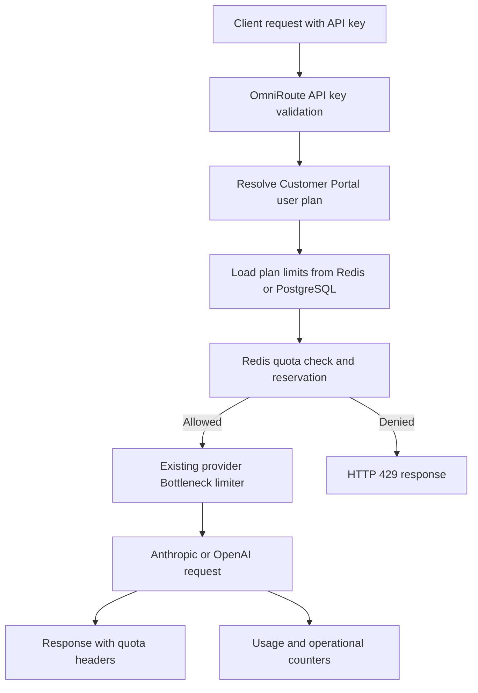

# Rate Limiting Implementation Guide

## Overview

OmniRoute now enforces subscription-tier request quotas for Customer Portal subscribers before requests are sent to Anthropic or OpenAI. The implementation adds a user-level quota layer in front of the existing provider-level throttling system so that platform capacity is protected at two levels:

1. **Subscription quota enforcement** limits how many requests an authenticated Pro or Pro Max user can make.
2. **Provider throttling** continues to protect upstream Anthropic and OpenAI accounts through the existing Bottleneck-based provider limiter.

The core service is [`UserRateLimitManager`](../OmniRoute/open-sse/services/userRateLimitManager.ts), which uses PostgreSQL for plan definitions and Redis for quota counters and plan caching. The chat pipeline integrates this service in [`chatCore.ts`](../OmniRoute/open-sse/handlers/chatCore.ts) after API-key plan resolution and before provider execution.

## Subscription Tiers

The Customer Portal defines paid plans in PostgreSQL through the Prisma [`Plan`](../customer-portal/prisma/schema.prisma) model and seeds Pro and Pro Max records in [`20260513_add_pro_plans`](../customer-portal/prisma/migrations/20260513_add_pro_plans/migration.sql).

| Tier | Plan ID | Price | Requests per minute | Requests per day | Requests per month | Providers |
|---|---|---:|---:|---:|---:|---|
| Pro | `pro` | `$5/month` | `60` | `10,000` | `300,000` | Anthropic, OpenAI |
| Pro Max | `pro-max` | `$25/month` | `300` | `100,000` | `3,000,000` | Anthropic, OpenAI |

> Note: The implemented values in [`migration.sql`](../customer-portal/prisma/migrations/20260513_add_pro_plans/migration.sql) and [`seed.mjs`](../customer-portal/prisma/seed.mjs) are the source of truth for deployment. Earlier planning material may contain lower recommended starting values.

## Architecture Summary

The subscription limiter is implemented as a separate layer that runs before provider request execution.



### Layering Rules

- Subscription quota checks apply only after the request is authenticated and mapped to a Customer Portal user plan.
- Subscription quota checks run before upstream provider calls.
- Anthropic and OpenAI requests consume the same subscription quota unit.
- Internal provider retries must not increment subscription quota multiple times.
- Streaming requests consume one quota unit when the stream is initiated.
- Provider-level throttling remains independent and is still handled by [`rateLimitManager.ts`](../OmniRoute/open-sse/services/rateLimitManager.ts).

## Components

| Component | File | Description |
|---|---|---|
| Architecture plan | [`plans/rate-limiting-architecture.md`](../../plans/rate-limiting-architecture.md) | Original design goals, architecture, data flow, Redis model, and rollout guidance. |
| Rate limit manager | [`userRateLimitManager.ts`](../OmniRoute/open-sse/services/userRateLimitManager.ts) | Enforces per-user quotas with Redis Lua scripts, plan caching, and PostgreSQL fallback. |
| Chat integration | [`chatCore.ts`](../OmniRoute/open-sse/handlers/chatCore.ts) | Resolves user plan, checks quota, returns `429` responses, and attaches quota headers. |
| Shared types | [`rateLimit.ts`](../OmniRoute/src/types/rateLimit.ts) | Defines `PlanLimits`, `UserPlan`, `QuotaInfo`, `QuotaWindowInfo`, and `RateLimitResult`. |
| Portal DB access | [`portalDb.ts`](../OmniRoute/src/lib/portalDb.ts) | Reads Customer Portal plan and user-plan data from PostgreSQL using `pg`. |
| Auth plan lookup | [`auth.ts`](../OmniRoute/src/sse/services/auth.ts) | Maps OmniRoute API key IDs to Customer Portal user plans with an in-memory cache. |
| Environment contract | [`.env.example`](../OmniRoute/.env.example) | Documents `PORTAL_DATABASE_URL`, `USER_RATE_LIMIT_ENABLED`, and `USER_RATE_LIMIT_FAIL_OPEN`. |
| Portal schema | [`schema.prisma`](../customer-portal/prisma/schema.prisma) | Defines `User`, `Plan`, and `UserApiKey` relationships used for subscription lookup. |
| Plan migration | [`migration.sql`](../customer-portal/prisma/migrations/20260513_add_pro_plans/migration.sql) | Upserts Pro and Pro Max plans into PostgreSQL. |
| Plan seed | [`seed.mjs`](../customer-portal/prisma/seed.mjs) | Seeds or updates Pro and Pro Max plan records through Prisma. |
| Package dependencies | [`package.json`](../OmniRoute/package.json) | Includes `pg` and `redis` runtime dependencies. |

## Data Flow

### Successful Request

```text
1. Client sends an Anthropic or OpenAI-compatible request with an OmniRoute API key.
2. OmniRoute validates the API key and obtains an API key ID.
3. `getUserPlanForApiKey` resolves the Customer Portal user and plan from PostgreSQL.
4. `UserRateLimitManager.checkUserRateLimit` normalizes the plan ID.
5. Plan limits are loaded from Redis cache or PostgreSQL.
6. Redis Lua script checks minute, day, and month quota windows atomically.
7. If allowed, Redis reserves one quota unit in all three windows.
8. The request proceeds to the existing provider limiter and provider executor.
9. The response is returned to the client with `X-RateLimit-*` quota headers.
10. `incrementUserUsage` can increment an operational success counter after completion.
```

### Rejected Request

```text
1. Client sends an authenticated request.
2. OmniRoute resolves the user and plan.
3. Redis detects that at least one quota window is exhausted.
4. The request is rejected before provider execution.
5. No Anthropic or OpenAI request is sent.
6. Client receives HTTP 429 with `Retry-After` and quota headers.
```

## Redis Keys

The implemented Redis key patterns are defined in [`UserRateLimitManager`](../OmniRoute/open-sse/services/userRateLimitManager.ts).

| Key pattern | Purpose | Window or TTL |
|---|---|---|
| `plan-limits:{planId}` | Cached plan limits loaded from PostgreSQL. | `300` seconds |
| `user-quota:{userId}:minute` | Sliding per-minute sorted set for quota reservations. | `60` seconds |
| `user-quota:{userId}:day:{yyyy-mm-dd}` | Daily sorted set for quota reservations. | `25` hours |
| `user-quota:{userId}:month:{yyyy-mm}` | Monthly sorted set for quota reservations. | `32` days |
| `user-usage-success:{userId}:day:{yyyy-mm-dd}` | Operational counter of successfully completed requests. | `25` hours |

### Redis Data Structures

- Quota keys use sorted sets.
- Each accepted request inserts a unique reservation ID scored by Unix time in milliseconds.
- The Lua script trims expired scores before counting current usage.
- The plan cache stores JSON with `requestsPerMinute`, `requestsPerDay`, `requestsPerMonth`, `planName`, `source`, and `cachedAt`.

### Atomic Quota Reservation

The quota reservation script checks all three windows in one Redis operation:

```text
trim minute window
trim day window
trim month window
if minute is exhausted: reject
else if day is exhausted: reject
else if month is exhausted: reject
else: add one reservation to minute, day, and month keys
return blocked window, retry-after, and current usage counts
```

This prevents concurrent requests from partially incrementing quota or exceeding limits due to race conditions.

## Database Schema

The Customer Portal PostgreSQL database stores plans and user-plan relationships. The relevant Prisma models are in [`schema.prisma`](../customer-portal/prisma/schema.prisma).

### Plan Table

| Prisma field | Database column | Type | Purpose |
|---|---|---|---|
| `id` | `id` | `String` | Stable plan ID such as `pro` or `pro-max`. |
| `name` | `name` | `String` | Display name. |
| `priceCents` | `price_cents` | `Int` | Monthly price in cents. |
| `requestsPerDay` | `requests_per_day` | `Int` | Daily request quota. |
| `requestsPerMinute` | `requests_per_minute` | `Int` | Burst request quota. |
| `requestsPerMonth` | `requests_per_month` | `Int` | Monthly request quota. |
| `allowedModels` | `allowed_models` | `String` | Model scope. Current seeded value is `*`. |
| `stripePriceId` | `stripe_price_id` | `String?` | Stripe price mapping when configured. |
| `featured` | `featured` | `Boolean` | Customer Portal display metadata. |
| `sortOrder` | `sort_order` | `Int` | Customer Portal display ordering. |

### Relationship Chain

```text
user_api_keys.omniroute_key_id
  -> user_api_keys.user_id
  -> users.id
  -> users.plan_id
  -> plans.id
```

[`portalDb.ts`](../OmniRoute/src/lib/portalDb.ts) uses this relationship to resolve the active plan for an OmniRoute API key ID.

## Feature Flags and Failure Modes

| Setting | Default | Effect |
|---|---:|---|
| `USER_RATE_LIMIT_ENABLED` | `true` | Enables or disables quota enforcement. |
| `USER_RATE_LIMIT_FAIL_OPEN` | `false` | Allows requests when Redis or PostgreSQL fails if explicitly enabled. |
| `PORTAL_DATABASE_URL` | none | PostgreSQL connection for Customer Portal plan lookups. |
| `REDIS_URL` or `REDIS_CONNECTION_STRING` | Redis client default | Redis connection for counters and plan cache. |

Default behavior favors cost control: when dependencies fail and fail-open is disabled, the service denies with `dependency_unavailable` or related errors rather than silently bypassing quotas.

## See Also

- [Deployment guide](./rate-limiting-deployment.md)
- [Testing guide](./rate-limiting-testing.md)
- [API documentation](./rate-limiting-api.md)
- [Operations runbook](./rate-limiting-operations.md)
- [Architecture document](../../plans/rate-limiting-architecture.md)
