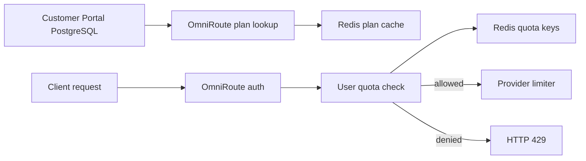

# Rate Limiting Operations Runbook

## Overview

This runbook helps operators monitor, troubleshoot, and maintain the Pro and Pro Max subscription rate limiting system. The system uses:

- PostgreSQL for Customer Portal user, API key, and plan records.
- Redis for live quota counters and plan cache.
- OmniRoute for request enforcement through [`UserRateLimitManager`](../OmniRoute/open-sse/services/userRateLimitManager.ts) and [`chatCore.ts`](../OmniRoute/open-sse/handlers/chatCore.ts).

## Operational Model



## Key Metrics and Alerts

### Core Metrics to Monitor

| Metric or signal | Source | Why it matters |
|---|---|---|
| Subscription requests by plan | OmniRoute logs or metrics | Confirms expected Pro and Pro Max usage. |
| `429` rate by plan and window | OmniRoute logs | Detects quota exhaustion, client loops, or abusive traffic. |
| Redis command latency | Redis monitoring | Quota checks are on the request path. |
| Redis error rate | Redis monitoring and OmniRoute logs | Dependency failures can block requests when fail-closed. |
| Redis memory usage | Redis monitoring | Quota sorted sets and cache keys must expire correctly. |
| PostgreSQL connection count | PostgreSQL monitoring | Plan lookups should not exhaust database connections. |
| PostgreSQL query latency | PostgreSQL monitoring | Slow plan lookup can delay requests on cache misses. |
| Plan cache hit rate | Derived from logs or Redis key observations | Low hit rate increases PostgreSQL load. |
| Provider request count | Provider logs or OmniRoute metrics | Should not increase for subscription-rejected requests. |
| Missing quota headers | Synthetic checks | Indicates integration or plan lookup issues. |

### Recommended Alerts

| Alert | Suggested trigger | Response |
|---|---|---|
| Redis unavailable | Redis health check fails or OmniRoute logs `Rate limit check failed`. | Check Redis service, network, credentials, and consider incident fail-open if approved. |
| High Redis latency | Sustained latency above normal baseline. | Inspect Redis CPU, memory, slowlog, and key cardinality. |
| PostgreSQL plan lookup failures | Repeated `Failed to fetch plan limits` or `Failed to fetch user plan`. | Check `PORTAL_DATABASE_URL`, connection pool, migrations, and database health. |
| Unexpected `429` spike | Sudden increase above normal baseline. | Determine if caused by abuse, client retry loops, or incorrect plan limits. |
| Missing Pro or Pro Max plans | Synthetic SQL check returns missing rows. | Re-run seed or migration. |
| Missing quota headers | Synthetic request lacks `X-RateLimit-*`. | Check API key mapping and Anthropic/OpenAI route path. |

## Troubleshooting

### Issue: Users receive `403 No active subscription plan found`

Likely causes:

- OmniRoute API key ID is not present in `user_api_keys.omniroute_key_id`.
- The Customer Portal user has no valid `plan_id`.
- `PORTAL_DATABASE_URL` points to the wrong database.
- PostgreSQL query failed and no cached plan exists.

Diagnosis:

```sql
SELECT
  k.omniroute_key_id,
  u.id AS user_id,
  u.email,
  u.plan_id,
  p.name
FROM user_api_keys k
JOIN users u ON u.id = k.user_id
LEFT JOIN plans p ON p.id = u.plan_id
WHERE k.omniroute_key_id = 'replace-with-api-key-id';
```

Resolution:

- Create or repair the `user_api_keys` mapping.
- Set `users.plan_id` to `pro` or `pro-max`.
- Confirm the plan exists in `plans`.
- Restart OmniRoute if environment variables were changed.

### Issue: Users receive unexpected `429`

Likely causes:

- User really exhausted minute, day, or month quota.
- Plan limits are lower than expected in PostgreSQL.
- Stale Redis plan cache has old limits.
- Automated client retry loop consumed quota quickly.

Diagnosis:

```bash
redis-cli -u "$REDIS_URL" ZCARD "user-quota:USER_ID:minute"
redis-cli -u "$REDIS_URL" ZCARD "user-quota:USER_ID:day:$(date -u +%F)"
redis-cli -u "$REDIS_URL" ZCARD "user-quota:USER_ID:month:$(date -u +%Y-%m)"
redis-cli -u "$REDIS_URL" GET "plan-limits:pro"
```

Resolution:

- Ask the user to wait for the relevant reset.
- Upgrade the user from Pro to Pro Max if appropriate.
- Correct plan limits in PostgreSQL.
- Clear stale plan cache with `DEL plan-limits:pro` or `DEL plan-limits:pro-max`.
- Reset user quota keys only for approved support cases.

### Issue: Requests fail when Redis is unavailable

Expected behavior with `USER_RATE_LIMIT_FAIL_OPEN=false` is fail-closed.

Diagnosis:

```bash
redis-cli -u "$REDIS_URL" PING
redis-cli -u "$REDIS_URL" INFO server
redis-cli -u "$REDIS_URL" INFO clients
```

Resolution:

- Restore Redis service.
- Check network ACLs and credentials.
- Scale Redis if CPU or memory is saturated.
- In an approved incident, temporarily set `USER_RATE_LIMIT_FAIL_OPEN=true` and monitor usage closely.

### Issue: Plan changes do not apply immediately

Likely cause: Redis plan cache TTL is still active.

Resolution:

```bash
redis-cli -u "$REDIS_URL" DEL plan-limits:pro
redis-cli -u "$REDIS_URL" DEL plan-limits:pro-max
```

The plan cache TTL is `300` seconds in [`UserRateLimitManager`](../OmniRoute/open-sse/services/userRateLimitManager.ts).

### Issue: Redis memory grows unexpectedly

Likely causes:

- Very high active user cardinality.
- Quota key TTLs are not being set.
- Load test data was not cleared.

Diagnosis:

```bash
redis-cli -u "$REDIS_URL" INFO memory
redis-cli -u "$REDIS_URL" --scan --pattern 'user-quota:*' | wc -l
redis-cli -u "$REDIS_URL" --scan --pattern 'user-quota:*' | head -20
```

Check TTL on sample keys:

```bash
redis-cli -u "$REDIS_URL" TTL "user-quota:USER_ID:minute"
redis-cli -u "$REDIS_URL" TTL "user-quota:USER_ID:day:$(date -u +%F)"
redis-cli -u "$REDIS_URL" TTL "user-quota:USER_ID:month:$(date -u +%Y-%m)"
```

## Redis Management

### Inspect Plan Cache

```bash
redis-cli -u "$REDIS_URL" GET plan-limits:pro
redis-cli -u "$REDIS_URL" GET plan-limits:pro-max
```

### Inspect User Quota

```bash
export USER_ID=replace-with-user-id
export DAY=$(date -u +%F)
export MONTH=$(date -u +%Y-%m)

redis-cli -u "$REDIS_URL" ZCARD "user-quota:$USER_ID:minute"
redis-cli -u "$REDIS_URL" ZCARD "user-quota:$USER_ID:day:$DAY"
redis-cli -u "$REDIS_URL" ZCARD "user-quota:$USER_ID:month:$MONTH"
```

### View Recent Reservation Scores

```bash
redis-cli -u "$REDIS_URL" ZRANGE "user-quota:$USER_ID:minute" 0 -1 WITHSCORES
```

Scores are Unix timestamps in milliseconds.

### Clear One User's Quota

Use only for support-approved resets.

```bash
redis-cli -u "$REDIS_URL" DEL \
  "user-quota:$USER_ID:minute" \
  "user-quota:$USER_ID:day:$DAY" \
  "user-quota:$USER_ID:month:$MONTH"
```

### Clear Plan Cache

```bash
redis-cli -u "$REDIS_URL" DEL plan-limits:pro plan-limits:pro-max
```

### Clear Load Test Data

Only in non-production Redis databases:

```bash
redis-cli -u "$REDIS_URL" FLUSHDB
```

## Plan Management

Plans are managed in Customer Portal PostgreSQL and modeled in [`schema.prisma`](../customer-portal/prisma/schema.prisma). Seed data lives in [`seed.mjs`](../customer-portal/prisma/seed.mjs).

### View Plans

```sql
SELECT id, name, price_cents, requests_per_minute, requests_per_day, requests_per_month
FROM plans
ORDER BY price_cents;
```

### Modify Pro Limits

```sql
UPDATE plans
SET requests_per_minute = 60,
    requests_per_day = 10000,
    requests_per_month = 300000
WHERE id = 'pro';
```

Then invalidate cache:

```bash
redis-cli -u "$REDIS_URL" DEL plan-limits:pro
```

### Modify Pro Max Limits

```sql
UPDATE plans
SET requests_per_minute = 300,
    requests_per_day = 100000,
    requests_per_month = 3000000
WHERE id = 'pro-max';
```

Then invalidate cache:

```bash
redis-cli -u "$REDIS_URL" DEL plan-limits:pro-max
```

### Add a New Plan

1. Add the plan to the Customer Portal database.
2. Ensure the plan has `requests_per_minute`, `requests_per_day`, and `requests_per_month` values.
3. Assign users by updating `users.plan_id`.
4. Confirm OmniRoute can normalize and resolve the plan ID.
5. Test with a mapped API key.

Example:

```sql
INSERT INTO plans (
  id, name, price_cents, requests_per_minute, requests_per_day, requests_per_month, allowed_models
)
VALUES ('enterprise', 'Enterprise', 10000, 1000, 1000000, 30000000, '*')
ON CONFLICT (id) DO UPDATE
SET name = EXCLUDED.name,
    price_cents = EXCLUDED.price_cents,
    requests_per_minute = EXCLUDED.requests_per_minute,
    requests_per_day = EXCLUDED.requests_per_day,
    requests_per_month = EXCLUDED.requests_per_month,
    allowed_models = EXCLUDED.allowed_models;
```

## User Management

### Find User by API Key ID

```sql
SELECT
  k.omniroute_key_id,
  u.id AS user_id,
  u.email,
  u.plan_id,
  p.name AS plan_name
FROM user_api_keys k
JOIN users u ON u.id = k.user_id
JOIN plans p ON p.id = u.plan_id
WHERE k.omniroute_key_id = 'replace-with-api-key-id';
```

### Upgrade User to Pro Max

```sql
UPDATE users
SET plan_id = 'pro-max'
WHERE id = 'replace-with-user-id';
```

Then clear relevant cache:

```bash
redis-cli -u "$REDIS_URL" DEL plan-limits:pro plan-limits:pro-max
```

The API-key-to-plan lookup in [`auth.ts`](../OmniRoute/src/sse/services/auth.ts) also has a short in-memory cache, so changes may require a brief wait or OmniRoute restart for immediate effect.

### Reset User Quota

Use this only with an approved support reason and audit trail.

```bash
export USER_ID=replace-with-user-id
export DAY=$(date -u +%F)
export MONTH=$(date -u +%Y-%m)

redis-cli -u "$REDIS_URL" DEL \
  "user-quota:$USER_ID:minute" \
  "user-quota:$USER_ID:day:$DAY" \
  "user-quota:$USER_ID:month:$MONTH"
```

### Check Successful Usage Counter

```bash
redis-cli -u "$REDIS_URL" GET "user-usage-success:$USER_ID:day:$DAY"
```

## Performance Tuning

### Redis

- Use a dedicated Redis instance or database for quota data in production.
- Monitor `used_memory`, `instantaneous_ops_per_sec`, `connected_clients`, and latency.
- Keep Redis close to OmniRoute instances to reduce request-path latency.
- Avoid running `KEYS` in production; use `SCAN`.
- Use eviction policies carefully. Quota keys should not be evicted early under normal conditions.
- Investigate slow Lua scripts with `SLOWLOG GET`.

Useful commands:

```bash
redis-cli -u "$REDIS_URL" INFO memory
redis-cli -u "$REDIS_URL" INFO stats
redis-cli -u "$REDIS_URL" SLOWLOG GET 10
redis-cli -u "$REDIS_URL" LATENCY DOCTOR
```

### PostgreSQL

- Keep indexes on `user_api_keys.omniroute_key_id`, `users.id`, `users.plan_id`, and `plans.id`.
- Use a read-only or least-privilege database user for OmniRoute if possible.
- Monitor connection counts because [`portalDb.ts`](../OmniRoute/src/lib/portalDb.ts) creates a small pool.
- Cache plan data in Redis and avoid unnecessary cache invalidation.
- Confirm migrations preserve existing users and plans.

Suggested indexes:

```sql
CREATE INDEX CONCURRENTLY IF NOT EXISTS idx_user_api_keys_omniroute_key_id
ON user_api_keys (omniroute_key_id);

CREATE INDEX CONCURRENTLY IF NOT EXISTS idx_users_plan_id
ON users (plan_id);
```

### OmniRoute

- Keep `USER_RATE_LIMIT_FAIL_OPEN=false` for normal production operation.
- Use structured logs around `USER_RATE_LIMIT` for support diagnosis.
- Ensure quota checks happen before provider execution to avoid provider spend on rejected requests.
- Use synthetic checks to validate quota headers after deploys.

## Incident Response Playbooks

### Redis Outage

1. Confirm Redis health with `PING` and service monitoring.
2. Check OmniRoute logs for `Rate limit check failed`.
3. Assess customer impact and provider spend risk.
4. Restore Redis or fail over to standby.
5. If approved, set `USER_RATE_LIMIT_FAIL_OPEN=true` temporarily.
6. Revert fail-open after Redis is healthy.
7. Review rejected requests and support tickets.

### Incorrect Plan Limits Deployed

1. Query current plan rows.
2. Update incorrect plan limits in PostgreSQL.
3. Clear `plan-limits:{planId}` Redis keys.
4. Run synthetic requests for affected plans.
5. Review users who were incorrectly rejected.
6. Reset user quotas only when business-approved.

### Client Retry Storm

1. Identify affected API key IDs or users from logs.
2. Confirm high `429` rate and low remaining minute quota.
3. Contact client owner with `Retry-After` guidance.
4. Temporarily lower concurrency or block abusive clients if necessary.
5. Confirm provider calls are not increasing for rejected requests.

## Next Steps

- Add dashboard panels for quota rejections by plan and window.
- Add an admin UI for support-safe user quota inspection and resets.
- Add automated synthetic checks for Pro and Pro Max quota headers.
- Add structured metrics from [`UserRateLimitManager`](../OmniRoute/open-sse/services/userRateLimitManager.ts) for cache hits, Redis latency, and rejection windows.

## See Also

- [Implementation guide](./rate-limiting-implementation.md)
- [Deployment guide](./rate-limiting-deployment.md)
- [Testing guide](./rate-limiting-testing.md)
- [API documentation](./rate-limiting-api.md)
