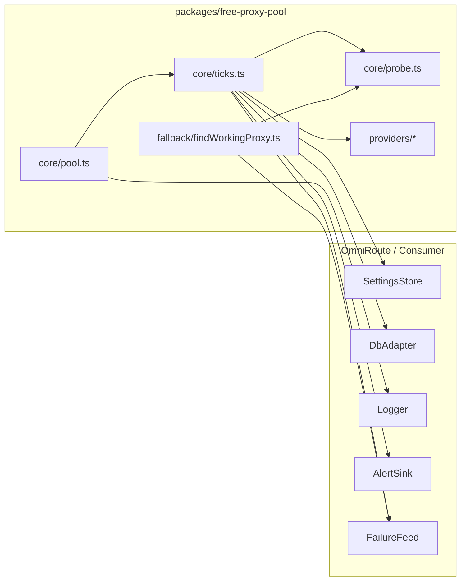

# Reusable Free Proxy Pool Package — Design Plan

## Goal

Extract the 3-tier free proxy management system from OmniRoute into a self-contained, framework-agnostic npm package (`packages/free-proxy-pool`) that any Node.js project can consume. The OmniRoute-specific couplings (SQLite schema, logger, settings keys, webhook dispatcher, proxy dispatcher) are abstracted behind **adapter interfaces** so the core logic is portable.

## Current State — Coupling Map

The proxy system lives across these OmniRoute files today:

| File | Role | OmniRoute coupling |
|---|---|---|
| `OmniRoute/src/lib/jobs/freeProxyJob.ts` | Scheduler, tick logic, tier promotion/demotion | `getDbInstance`, `getSettings`, `createLogger`, `getRecentProxyFailures`, `dispatchEvent`, `distributeProxiesToAccounts`, `getEnabledProviders`, `proxyEgress` |
| `OmniRoute/src/lib/proxyLogger.ts` | In-memory ring buffer + SQLite persistence of proxy events | `getDbInstance`, `isCloud`, `isBuildPhase` |
| `OmniRoute/open-sse/utils/proxyFallback.ts` | `testSingleProxy`, `findWorkingProxy`, candidate collection, negative/positive cache | `undici`, `createProxyDispatcher`, `resolveProxyForScopeFromRegistry`, `listProxies`, `listOneproxyProxies`, `listFreeProxies`, `isFeatureFlagEnabled` |
| `OmniRoute/src/lib/db/freeProxies.ts` | `free_proxies` table CRUD (upsert, list, tier, delete, record test result) | `getDbInstance`, raw SQL |
| `OmniRoute/src/lib/freeProxyProviders/*` | 5 scrapers behind `FreeProxyProvider` interface | **Already clean** — only depends on `fetch` + `FreeProxySourceId` union |
| `OmniRoute/src/lib/db/settings.ts` | Runtime settings store (reads `freeProxy*` keys) | `getDbInstance`, `key_value` table |
| `OmniRoute/src/lib/webhooks/eventDescriptions.ts` | `WebhookEvent` union + `dispatchEvent` | OmniRoute-specific event names |

### Hard couplings to abstract

1. **DB** — raw SQL against 3 tables: `free_proxies`, `proxy_registry`, `proxy_assignments`. The job assumes column names and joins.
2. **Logger** — `createLogger("free-proxy-job")` returns a pino-style logger.
3. **Settings** — `getSettings()` returns a record with `freeProxy*` keys.
4. **Alerting** — `dispatchEvent(event, payload)` against OmniRoute's webhook union.
5. **Failure feed** — `getRecentProxyFailures()` reads an in-memory ring buffer.
6. **Proxy probe** — `testSingleProxy` uses `createProxyDispatcher` (undici ProxyAgent).
7. **Candidate sources** — registry + 1proxy + env proxy; OmniRoute-specific address book.

## Proposed Package Layout

```
packages/free-proxy-pool/
├── package.json              # name: @ai-platform/free-proxy-pool
├── tsconfig.json             # composite, ES2020, strict
├── README.md
├── src/
│   ├── index.ts              # public API re-exports
│   ├── types.ts              # ProxyShape, FreeProxyRecord, FreeProxyItem, JobSettings, Tiers
│   ├── adapters.ts           # adapter interfaces (the "seams")
│   ├── core/
│   │   ├── pool.ts           # createFreeProxyPool() factory + controller
│   │   ├── ticks.ts          # runCheckTick, runSyncTick (framework-agnostic)
│   │   ├── promoteDemote.ts  # promoteProxyToGlobal, demoteTier3ToTier2, distribute
│   │   └── probe.ts          # testProxyMultiTarget (uses ProxyProbe adapter)
│   ├── fallback/
│   │   ├── findWorkingProxy.ts   # cache + findWorkingProxy (uses CandidateSource adapter)
│   │   └── testSingleProxy.ts    # uses ProxyProbe adapter
│   ├── providers/
│   │   ├── types.ts          # FreeProxyProvider interface (already clean)
│   │   ├── iplocate.ts
│   │   ├── oneproxy.ts
│   │   ├── proxifly.ts
│   │   ├── proxypool.ts
│   │   └── proxyscraper.ts
│   └── adapters/
│       ├── sqlite-adapter.ts # default concrete DbAdapter for better-sqlite3 / bun:sqlite
│       ├── console-logger.ts # default no-op-ish logger
│       ├── in-memory-settings.ts  # default SettingsStore
│       ├── ring-buffer-failures.ts # default FailureFeed implementation
│       └── undici-probe.ts    # default ProxyProbe using undici ProxyAgent
└── tests/
    └── core.test.ts
```

## Adapter Interfaces (`src/adapters.ts`)

These are the seams. A consumer implements them against their own infra.

```ts
// ─── DB ───────────────────────────────────────────────────────────────
export interface FreeProxyRow {
  id: string;
  tier: 1 | 2 | 3;
  type: string;       // "http" | "https" | "socks5"
  host: string;
  port: number;
  country_code: string | null;
  in_pool: 0 | 1;
  consecutive_successes: number;
  consecutive_failures: number;
  test_count: number;
  success_count: number;
  quality_score: number | null;
  latency_ms: number | null;
}

export interface GlobalPoolRow {
  registryId: string;
  type: string;
  host: string;
  port: number;
}

/** Abstraction over the free_proxies + proxy_registry + proxy_assignments tables. */
export interface DbAdapter {
  listTier(tier: 1 | 2 | 3, countryFilter: string | "ALL"): Promise<FreeProxyRow[]>;
  listGlobalPool(): Promise<GlobalPoolRow[]>;
  countGlobalPool(): Promise<number>;
  recordTestResult(id: string, ok: boolean, latencyMs: number | null, quality: number): Promise<void>;
  setTier(id: string, tier: 1 | 2 | 3): Promise<void>;
  resetCounters(id: string): Promise<void>;
  delete(id: string): Promise<void>;
  /** Move a proxy from the global registry back to Tier 2. */
  demoteFromGlobalPool(registryId: string, host: string): Promise<void>;
  /** Insert into proxy_registry + free_proxies tier=3 + slot assignment. Returns nothing on duplicate. */
  promoteToGlobalCandidate(candidate: FreeProxyRow, country: string, poolSize: number, namePrefix: string): Promise<void>;
  /** Cleanup non-matching country proxies that are not in the live pool. */
  deleteNonMatchingCountry(country: string): Promise<number>;
}

// ─── Logger ───────────────────────────────────────────────────────────
export interface Logger {
  info(msg: string, meta?: Record<string, unknown>): void;
  warn(msg: string, meta?: Record<string, unknown>): void;
  error(msg: string, meta?: Record<string, unknown>): void;
  debug(msg: string, meta?: Record<string, unknown>): void;
}

// ─── Settings ─────────────────────────────────────────────────────────
export interface JobSettings {
  enabled: boolean;
  checkIntervalMs: number;
  syncIntervalMs: number;
  countryFilter: string | "ALL";
  minQuality: number;
  minTests: number;
  minSuccessRate: number;
  autoElevate: boolean;
  poolSize: number;
  autoRemoveDead: boolean;
  tier1PromoteThreshold: number;
  tier2DemoteThreshold: number;
  liveFailThreshold: number;
  autoDistribute: boolean;
}

export interface SettingsStore {
  get(): Promise<JobSettings>;
  /** Called when key_value changes; returns true if a reload is warranted. */
  shouldReload(prev: JobSettings, next: JobSettings): boolean;
}

// ─── Alerting ─────────────────────────────────────────────────────────
export type ProxyPoolAlert =
  | { type: "proxy.demoted"; tier: 1 | 2 | 3; host: string; port: number; reason: string; failures?: number }
  | { type: "proxy.pool-low"; liveCount: number; threshold: number };

export interface AlertSink {
  emit(alert: ProxyPoolAlert): Promise<void>;
}

// ─── Failure feed ─────────────────────────────────────────────────────
export interface FailureFeed {
  /** Returns a Map<host:port, failureCount> within the window. */
  recentFailures(windowMs: number): Map<string, number>;
  /** Record a live proxy event for the ring buffer (optional). */
  record?(entry: { host: string; port: number; ok: boolean; ts?: number }): void;
}

// ─── Proxy probe ──────────────────────────────────────────────────────
export interface ProxyProbe {
  /** Test one proxy against one target URL. Any HTTP response = ok. */
  test(proxyUrl: string, targetUrl: string, timeoutMs: number): Promise<{ ok: boolean; latencyMs: number | null }>;
}

// ─── Candidate sources (for findWorkingProxy) ────────────────────────
export interface CandidateSource {
  /** Collect proxy URLs to try, in priority order. */
  list(targetUrl?: string): Promise<string[]>;
}

// ─── Provider plugins (already clean, kept as-is) ────────────────────
export interface FreeProxyProvider {
  readonly id: string;
  isEnabled(): boolean;
  sync(): Promise<{ fetched: number; added: number; updated: number; errors: Error[] }>;
}
```

## Public API (`src/index.ts`)

```ts
export function createFreeProxyPool(deps: {
  db: DbAdapter;
  logger: Logger;
  settings: SettingsStore;
  alerts: AlertSink;
  failures: FailureFeed;
  probe: ProxyProbe;
  providers: FreeProxyProvider[];
  testTargets: string[];        // multi-target liveness URLs
  distribute?: () => Promise<void>; // optional auto-distribute hook
}): FreeProxyPool;

export interface FreeProxyPool {
  start(): void;
  stop(): void;
  reload(): Promise<void>;
  runCheckTick(): Promise<void>;
  runSyncTick(): Promise<void>;
  /** Delegated fallback helpers usable by the host for live traffic. */
  findWorkingProxy(targetHostname: string, targetUrl: string): Promise<string | null>;
}
```

## Default Adapters (`src/adapters/*`)

The package ships **concrete default adapters** so a consumer can be running in minutes without writing everything from scratch:

| Adapter | Implementation | Dependency |
|---|---|---|
| `sqlite-adapter.ts` | `DbAdapter` backed by better-sqlite3 / bun:sqlite against the same 3-table schema (documented in README + a `migrations/*.sql`) | `better-sqlite3` (peer) |
| `console-logger.ts` | `Logger` that routes to `console.log/warn/error` | none |
| `in-memory-settings.ts` | `SettingsStore` holding a plain object, mutatable via `set()` | none |
| `ring-buffer-failures.ts` | `FailureFeed` with a capped array + `record()` | none |
| `undici-probe.ts` | `ProxyProbe` using `undici` `ProxyAgent` (no OmniRoute dispatcher dependency) | `undici` (peer) |

## OmniRoute Integration (`src/lib/jobs/freeProxyJob.ts` → thin wrapper)

After extraction, `OmniRoute/src/lib/jobs/freeProxyJob.ts` becomes a ~80-line adapter file:

```ts
import { createFreeProxyPool } from "@ai-platform/free-proxy-pool";
import { getDbInstance } from "@/lib/db/core";
import { getSettings } from "@/lib/db/settings";
import { createLogger } from "@/shared/utils/logger";
import { dispatchEvent } from "@/lib/webhookDispatcher";
import { getRecentProxyFailures } from "@/lib/proxyLogger";
import { getEnabledProviders } from "@/lib/freeProxyProviders";
import { distributeProxiesToAccounts } from "./freeProxyJob"; // keep

const pool = createFreeProxyPool({
  db: new OmniRouteDbAdapter(getDbInstance),
  logger: wrapPinoLogger(createLogger("free-proxy-job")),
  settings: new OmniRouteSettingsStore(getSettings),
  alerts: { emit: (a) => dispatchEvent(a.type, a) },
  failures: { recentFailures: (w) => getRecentProxyFailures(w) },
  probe: new OmniRouteProxyProbe(),  // wraps createProxyDispatcher
  providers: getEnabledProviders(),
  testTargets: ["https://api.openai.com/v1/models", "https://api.anthropic.com/v1/messages", "https://oidc.us-east-1.amazonaws.com/"],
  distribute: distributeProxiesToAccounts,
});

export function startFreeProxyJob() { pool.start(); }
export function stopFreeProxyJob() { pool.stop(); }
export async function reloadFreeProxyJob() { return pool.reload(); }
export async function runFreeProxyCheckTick() { return pool.runCheckTick(); }
```

`OmniRouteDbAdapter` is a ~150-line class that translates the adapter interface calls into the existing raw SQL (the same SQL that's currently inline in `freeProxyJob.ts`, just relocated). The schema stays identical — no migration needed.

## Migration Strategy (Non-Breaking)

1. Create `packages/free-proxy-pool/` with adapters + defaults.
2. Port logic **verbatim** (same SQL, same constants, same algorithm) so behaviour is byte-identical.
3. Add `OmniRouteDbAdapter` + thin wrapper in OmniRoute.
4. Wire `server-init.ts` / `instrumentation-node.ts` to call the new `startFreeProxyJob` (unchanged export signature).
5. Delete the now-dead inline SQL from `freeProxyJob.ts`.
6. Keep `proxyLogger.ts` and `proxyFallback.ts` in place — they expose the existing exports the adapter wraps, so live traffic code is untouched.

The 6 improvements already merged (parallelization, multi-target, live-failure demote, negative cache, alerting, settings snapshot) get carried into the package unchanged.

## What Stays in OmniRoute

- `proxyLogger.ts` (ring buffer + SQLite log) — host's responsibility; exposed via `FailureFeed` adapter.
- `proxyFallback.ts` candidate gathering (`getProxyCandidates`) — host's address book; exposed via `CandidateSource` adapter.
- `webhookDispatcher.ts` — host's alerting; exposed via `AlertSink`.
- Settings UI / `key_value` table — host's `SettingsStore`.
- `freeProxyProviders/*` — **moves into the package** (already decoupled).

## Mermaid — Component Wiring



## Todo Checklist

- [ ] Design package layout (packages/free-proxy-pool) with adapter interfaces
- [ ] Create package.json, tsconfig.json, README
- [ ] Define adapter interfaces (DbAdapter, Logger, SettingsStore, AlertSink, FailureFeed, ProxyProbe, CandidateSource)
- [ ] Port core job logic into framework-agnostic core (createFreeProxyPool)
- [ ] Port multi-target probe + findWorkingProxy with pluggable candidate sources
- [ ] Port provider plugin interface + the 5 scrapers (already decoupled)
- [ ] Add SQLite default adapter (concrete implementation consumers can use)
- [ ] Wire OmniRoute to consume the package (thin OmniRouteAdapter wrapping existing infra)
